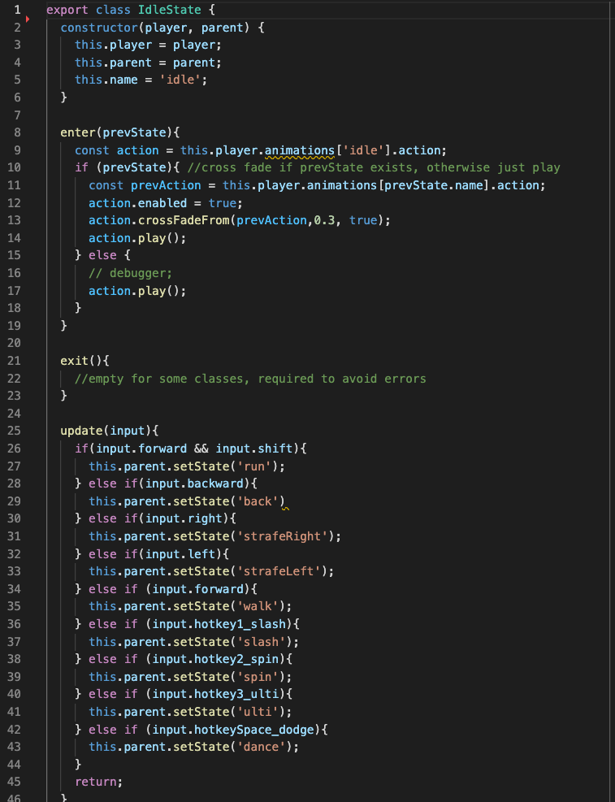
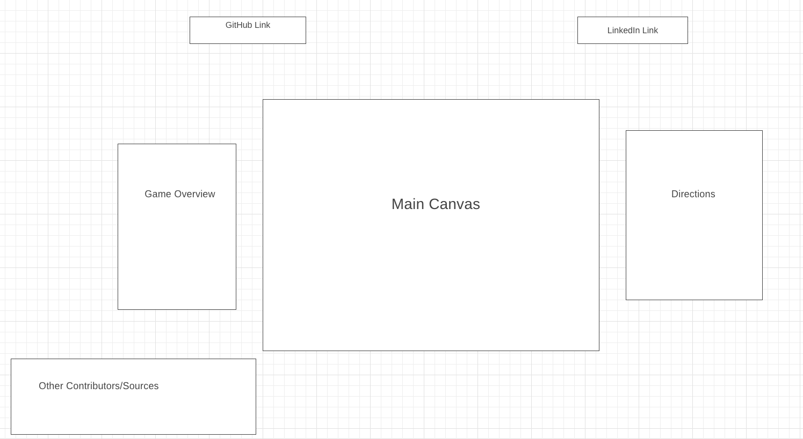

**
Swing and Survive
**

  This is an action combat hack and slash game. 
Play Here: <a href="https://hermanh36.github.io/JS_Project/">Swing and Survive</a> 

Move, dodge, and position yourself using your mouse and keyboard to avoid the deadly attacks 
of the boss monster in the middle. You can fight back using cooldown based skills assigned  
on keys 1-5 and score points based how long you survive and how much damage you dealt to the boss.

**Libraries and Technologies Used**
* Javascript
* THREE.js
* HTML 5
* CSS

**Functionality and MVPs**

**Completed**
* Backbone logic of finite state machine
* Rendering initial canvas
* Importing character animations and models
* Character controls and keybinds

**Core Missing Features**
* Custom camera that binds to character movement
* Character velocity vectors
* Boss Models and Actions
* GUI for character and boss stats
* Stage and boundaries
* Model Collisions animation and logic
* Boss attack logic

**Bonus Features**
* Background Music and 3D sound effects for skills and collisions
* Additional skill effects
* Pause screen
* Front View Camera When a Button is Held

 
 
 

**Character State Example**
Here's a code snippet of how the various states of the character functions. 
The enter and exit methods are used when another state is entering into the  
current state or the current state is transitioning to another state. The  
update method periodically reads for player input everytime render is called  
and changes state depending on whether a button is pressed or not. 

 

**Character Skill Demo**
Here's a demo of what the character model can do. More abilities to 
be added! 

**Wireframe**
  

**Credit and Acknowledgements**
* <a href="https://www.youtube.com/channel/UCEwhtpXrg5MmwlH04ANpL8A?app=desktop">SimonDev</a> for doing an awesome in depth tutorial of game design in THREE.js.
* <a href="https://www.mixamo.com/">Mixamo</a> for supplying various models and animations.
* <a href ="https://www.cgtrader.com/">CGTrader</a> for supplying skybox textures.
* <a href="https://wallpapercave.com/">WallPaperCave</a> for supplying the background image for my website.

